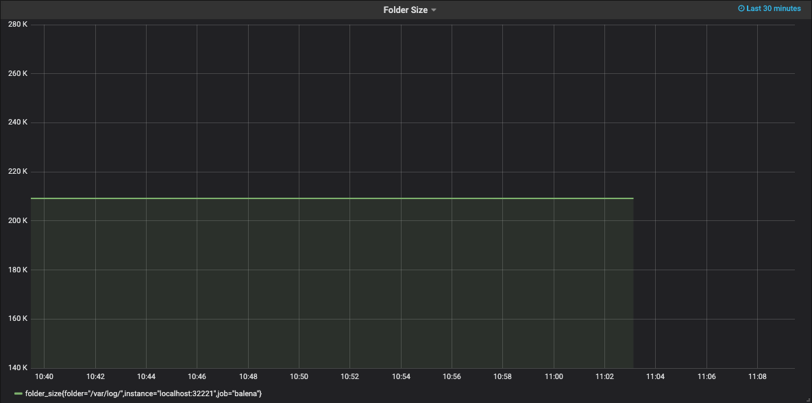
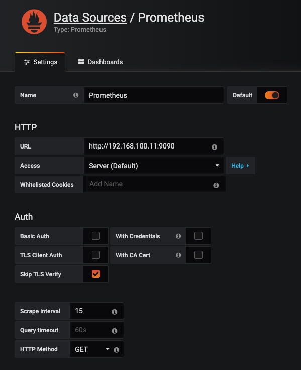

# Monitor your Raspberry Pi using Rust, Prometheus and Grafana

## Introduction

Monitoring your balena-powered applications, services or even hardware is crucial for proper management. Prometheus is an open-source monitoring tool that allows gathering data from numerous services through exporters.

However, sometimes you may find yourself in a situation where you need a custom exporter for your use case. Rust, which is becoming an increasingly popular programming language and [loved](https://insights.stackoverflow.com/survey/2019#most-loved-dreaded-and-wanted) by most developers is ideal for writing custom exporters. The exporter can be compiled as a single binary and the helper library, [`prometheus_exporter_base`](https://github.com/MindFlavor/prometheus_exporter_base), makes it very easy.

This project provisions a custom exporter written in Rust along with Prometheus and [Grafana](https://grafana.com/) for visualising our gathered metrics. For demo purposes, all of the services run on a Raspberry Pi. Ideally, you would deploy Prometheus and Grafana directly in the cloud and point the exporter to the Prometheus instance.

## Goals

1. Showcase an example of a custom prometheus exporter written in Rust

2. Gather data in Prometheus and visualise it using Grafana

The custom exporter in this project can be adapted for particular use cases.

## Requirements

A Raspberry Pi running balenaOS.

- Follow the steps to provision your device based on the numerous getting started guides on [balena.io](balena.io). The "Get started with Raspberry and Rust" is a good place to start. Follow the guide until the "provisioning" step. We will deploy our code in the steps below.

## Walk-through

1. While provisioning your device you should have already created an application
2. Clone the project

   - The exporter service is responsible for collecting the metrics. In this tutorial we are monitoring the size of the `"/var/log"` folder. Feel free to modify the code to suit your particular use case.

   - You can also change the [metric type](https://prometheus.io/docs/concepts/metric_types/)

3. Push the code to your application using either the [`balena-cli`](https://www.balena.io/docs/reference/cli/#push-applicationordevice) or `git`.

4. If you enable the [public URL](https://www.balena.io/docs/learn/manage/actions/#enable-public-device-url) for the device, you can access the Grafana application running on the device using the device's public url. Otherwise, it is accessible using the device's `ip` address if you are on the same network.

   - Use the default username(admin) and password(admin)
   - It is highly recommended to change the default credentials

5. Follow the steps to add a datasource

   - Make sure to choose Prometheus
   - Use the default settings
   - Click 'save and test' to make sure the data source is working

   - It is also possible to [manage datasources](https://grafana.com/docs/administration/provisioning/#datasources) by adding a `yaml` config file in the `provisioning/datasources` directory.

   

6. Once the data source has been configured, you can create your dashboards according to the type of metrics you are exporting.

   - It is also possible to [manage dashboards](https://grafana.com/docs/administration/provisioning/#dashboards) in Grafana by adding a `yaml` config files in the `provisioning/dashboards` directory.

That's it, Congrats! You should have a working prometheus exporter and be able to visualise your newly created dashboard.

## Going Further

Read the "Let's build a Prometheus exporter in Rust" blog post by [Francesco Cogno](https://dev.to/mindflavor) who is also the author of `prometheus_exporter_base`. This project also uses the sample code provided by the `prometheus_exporter_base` library.

You can experiment further by tweaking the custom exporter code. For example you can export GPIO pin states, sensor values and more. You can use [`rust_gpiozero`](https://crates.io/crates/rust_gpiozero) for easy GPIO access using Rust (_Disclaimer: I am the author of the crate_) or [`rppal`](https://crates.io/crates/rppal) if you need more low-level access.

## References and Acknowledgement

1. [Prometheus exporter base](https://github.com/MindFlavor/prometheus_exporter_base)

2. [Let's build a Prometheus exporter in Rust](https://dev.to/mindflavor/let-s-build-a-prometheus-exporter-in-rust-30pd)

3. [Monitoring the edge with Prometheus pt. 1](https://www.balena.io/blog/monitoring-the-edge-with-prometheus-pt-1/)

4. [does-rpi3-mqtt](https://github.com/DynamicDevices/does-rpi3-mqtt)
